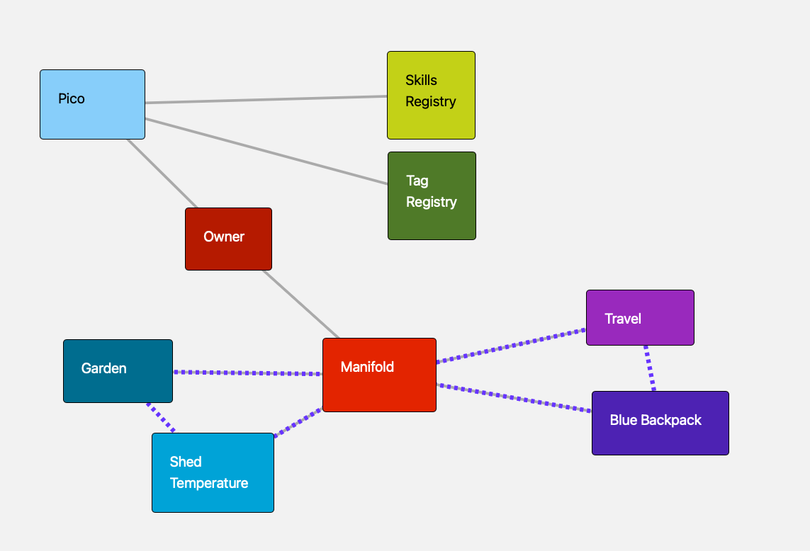

# Sensor Network

KRL rulesets for a LoRaWAN sensor network on [Manifold](https://manifold.picolabs.io/) and the [Pico Engine](https://github.com/Picolab/pico-engine). Sensor communities and devices are **Manifold picos** — this repo adds sensor-specific behavior on top of Manifold's thing/community platform rather than managing its own pico hierarchy.

Supported hardware today is **Dragino** LoRaWAN sensors (LHT65, LSE01, LSN50, WL03A-LB, and related types). Each sensor type has a router ruleset in this repo that decodes payloads and raises `sensor` domain events.

**Prerequisite:** a bootstrapped Manifold installation ([`manifold-api`](../manifold-api) — tag registry, owner pico, Manifold pico with `io.picolabs.manifold_pico`, notifications, and base `io.picolabs.thing` / `io.picolabs.community` rulesets).

Integration tests: [`t/README.md`](t/README.md).

## How this repo uses Manifold

Sensor-network rulesets delegate most pico lifecycle work to Manifold and focus on sensor-specific setup and event handling.

| Manifold service | Used for |
|------------------|----------|
| **Community creation** (`manifold new_community`) | Creates the community child pico, installs `io.picolabs.community`, and establishes the Manifold↔community subscription |
| **Thing creation** (`manifold create_thing`) | Creates bare sensor thing picos with `io.picolabs.thing`; community receives a `community thing_created` callback to finish setup |
| **Subscriptions** | Community↔thing membership; thing events forwarded via `community thing_event_occurred` |
| **Notifications** (`manifold add_notification`, `change_notification_setting`) | Threshold alerts from a community are routed to Manifold's notification platform (inbox, SMS, Prowl, etc.) instead of calling external services directly |
| **Wrangler** | Child picos, channels, ruleset install requests |

Events and queries for sensor bootstrap and community management go through the **Manifold app channel** (not the UI channel — the UI channel's event policy blocks the `sensor` domain).



Solid lines are parent/child relationships; dashed lines are subscriptions. Sensor communities and things are Manifold picos — this repo adds sensor-specific rulesets on top.

## Bootstrap

### 1. Install sensor network bootstrap on the Manifold pico

After Manifold itself is bootstrapped, install **`io.picolabs.sensor.network_bootstrap`** on the Manifold pico. This ruleset:

- Handles `sensor create_community` and delegates to Manifold's generic community machinery
- Installs **`io.picolabs.sensor.community`** on each new community child
- Records communities in `ent:sensor_communities` (query via `getSensorCommunities()`)
- Enables notification channels for each community (default: Manifold inbox only)

### 2. Create a sensor community

Raise **`sensor create_community`** on the Manifold pico's app channel:

```
POST /sky/event/{manifold_app_eci}/eid/sensor/create_community
attrs: { "name": "My Sensors", "description": "..." }
```

Optional: `"notify_channels": "Manifold,SMS,Prowl"` to opt the community into additional notification channels.

**What happens (three steps inside `network_bootstrap`):**

1. **Delegate to Manifold** — `network_bootstrap` raises `manifold new_community` with a correlation id (`rcn`) and `sensor_bootstrap: true`. Manifold creates the child pico, installs `io.picolabs.community`, and subscribes it as a Manifold community.

2. **Install sensor.community** — On `wrangler child_initialized` for that community, `network_bootstrap` installs `io.picolabs.sensor.community` on the child and records it in `ent:sensor_communities`.

3. **Provision notifications** — Raises `manifold change_notification_setting` for each requested channel so threshold alerts from this community can reach the owner.

The community pico exposes a **`sensor` channel** (for `sensor initiation` and related events) and a **`manifold_callback` channel** (for Manifold's thing-creation callback).

### 3. Add a sensor (thing)

Raise **`sensor initiation`** on the community's **sensor channel**:

```
POST /sky/event/{community_sensor_eci}/eid/sensor/initiation
attrs: { "name": "Garden LHT65", "type": "lht65" }
```

**What happens (delegation pattern in `sensor.community`):**

1. **Delegate to Manifold** — The community sends `manifold create_thing` to its parent (Manifold pico) with `{ name, callback_eci, rcn }` and stashes sensor type / ruleset list under `rcn`.

2. **Manifold creates the thing** — Manifold creates a child pico, installs `io.picolabs.thing`, subscribes it, and calls back on the community's `manifold_callback` channel with `community thing_created`.

3. **Finish sensor setup** — The community raises `community add_thing` (joins the thing to the community) and installs sensor rulesets on the thing:
   - Always: `io.picolabs.sensor.thresholds`, `io.picolabs.iotplotter`, `io.picolabs.dragino`
   - Per type: e.g. `io.picolabs.lht65.router` for `type: "lht65"`

Sensor readings and threshold violations flow back through the community subscription as `community thing_event_occurred` events, are re-raised into the `sensor` domain, and can trigger **`manifold add_notification`** on the Manifold pico.

## Rulesets

| Ruleset | Installed on | Purpose |
|---------|--------------|---------|
| `io.picolabs.sensor.network_bootstrap` | Manifold pico | Community creation orchestration, `getSensorCommunities()` |
| `io.picolabs.sensor.community` | Community picos | Sensor channel, thing delegation, readings, threshold → notifications |
| `io.picolabs.sensor.thresholds` | Thing picos | Threshold monitoring |
| `io.picolabs.dragino` | Thing picos | Shared Dragino helpers |
| `io.picolabs.iotplotter` | Thing picos | Plotting / visualization hooks |
| `io.picolabs.lht65.router` | LHT65 things | Decode LHT65 payloads |
| `io.picolabs.lse01.router` | LSE01 things | Decode LSE01 payloads |
| `io.picolabs.lsn50.router` | LSN50 things | Decode LSN50 payloads |
| `io.picolabs.wl03a_lb.router` | WL03A-LB things | Decode WL03A-LB payloads |

To add a sensor type, register it in `rids_to_install` inside `io.picolabs.sensor.community.krl` and add a router ruleset to this repo.

## Dependencies

- **[manifold-api](../manifold-api)** — Manifold platform rulesets (`manifold_pico`, `thing`, `community`, notifications, bootstrap). Required at runtime; the integration test harness mounts both repos into one pico-engine container.
- **Pico Engine modules** — `io.picolabs.wrangler`, `io.picolabs.subscription` (provided by the engine).

## Integration tests

From the repo root:

```bash
npm install
npm test
```

See [`t/README.md`](t/README.md) for the full harness (parse gate, Docker, Manifold bootstrap, sensor scenarios, cleanup).
